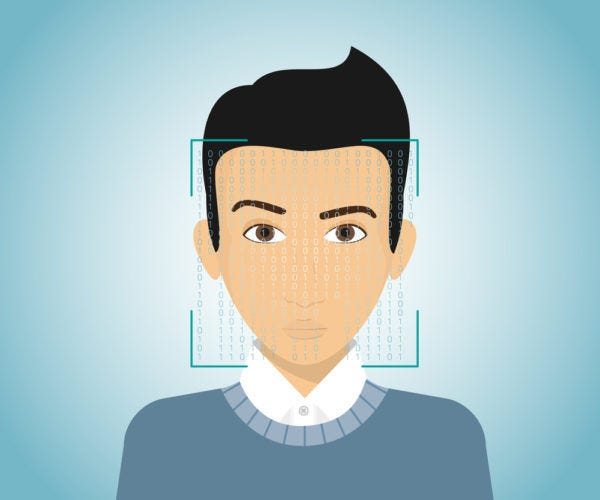
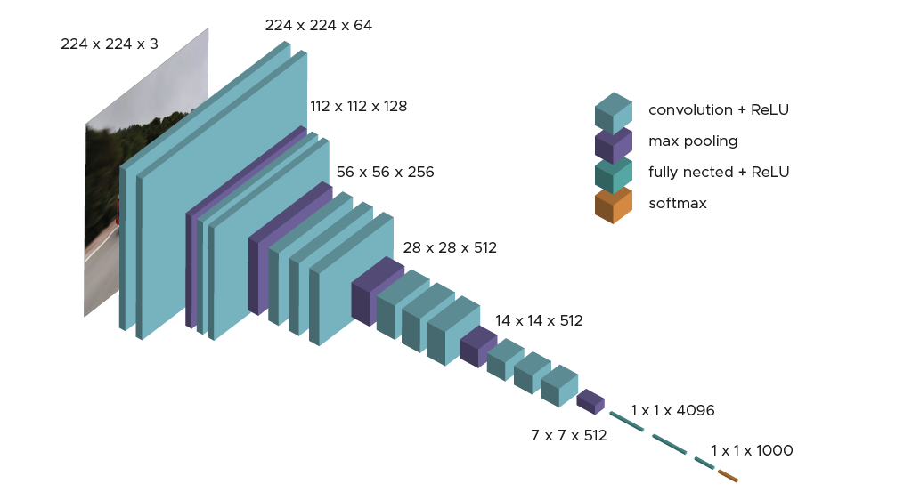

<div align="center">

## Face Detection



</div>

<br>


This project is based on the face detection project available [here](https://github.com/nicknochnack/FaceDetection/tree/main). The aim of this project is to bring structure to the original code to make it easier to understand and use. In addition, explanations are added on how to build machine learning models using the TensorFlow and Keras open source libraries.

The main aim of this project is to improve my skills in building machine learning models with the [Tensorflow](https://www.tensorflow.org/?hl=fr) and [Keras](https://www.tensorflow.org/?hl=fr) libraries.

In addition, a **Flask** application is available to facilitate the use of the face detection model once it has been trained.


## Model 

The face detection model is built upon the **VGG16 architecture**, which is a widely used convolutional neural network (CNN) for image classification tasks. However, some changes have been made to the original VGG16 by adding additional layers for face detection purposes.

The model consists of two main components:

**- Classification Layer**: This layer is responsible for determining whether a face is present or not in the input image. It outputs a binary classification result.  
**- Regression Layer**: This layer calculates the bounding box coordinates for face localization. It predicts the coordinates necessary to define a rectangular bounding box around the detected face.

<br>

<div align="center">

<h4> VGG16 Model Architecture</h4>
</div>

<br>

## Installation

Clone the project
```bash
git clone https://github.com/mohamedfattouhy/FaceDetection.git
```

Install dependencies
```bash
pip install -r requirements.txt
```

Create a virtual environment
```bash
python -m venv face_detection_venv
```

Activate the virtual environment
```bash
source face_detection_venv/bin/activate # Linux
.\face_detection_venv\Scripts\activate # Windows 
```

## Usage

Move to directory
```bash
cd FaceDetection
````

Run the configuration file to collect data and train the face detection model
```bash
python configuration.py
````

Run the Flask app to try in the trained model with your webcam
```bash
flask run
````


